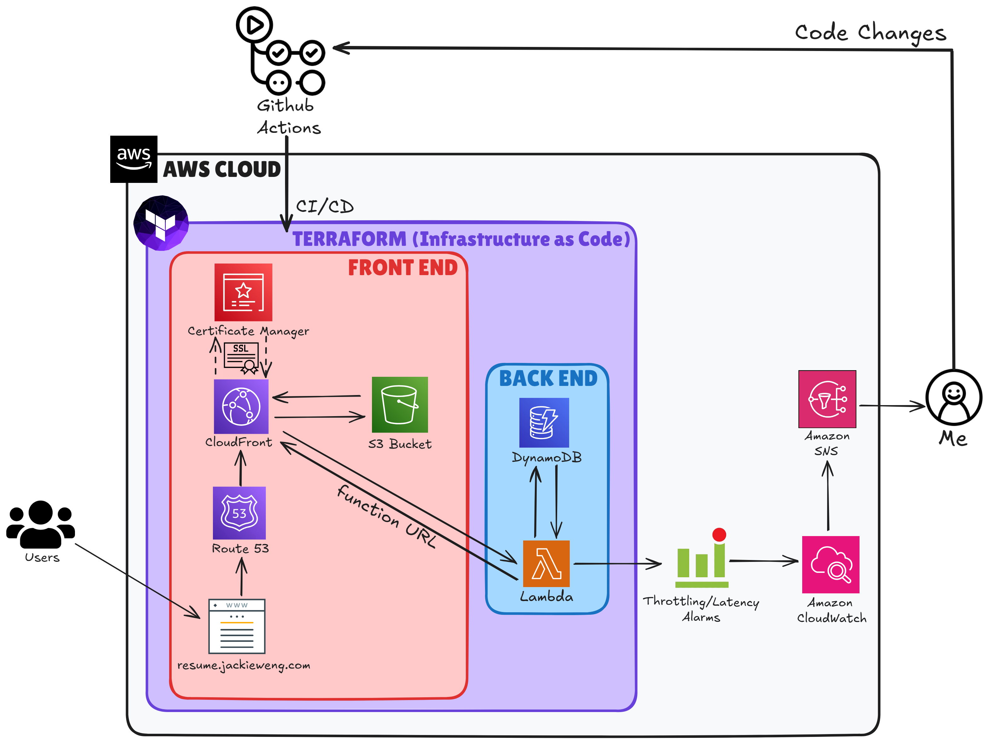

# Terraform-AWS-Cloud-Resume

This is the Terraform version of my cloud resume. 

I completed this project to participate in the [AWS version of the Cloud Resume Challenge](https://cloudresumechallenge.dev/docs/the-challenge/aws/). 
The Cloud Resume Challenge, originally published by Forrest Brazeal, is a multiple-step resume project which helps build and demonstrate skills fundamental to pursuing a career in Cloud. 

A full retrospective for my project can be [found on my website](https://jackieweng.com/aws-resume-retrospective.html).

## Cloud Architecture

### Services used:
<table border="1" style="border-collapse: collapse; width: 100%;"> <tr> <th style="text-align: center; padding: 8px;">Skill Category</th> <th style="text-align: center; padding: 8px;">Technologies & Implementation Details</th> </tr> <tr> <td style="text-align: center; padding: 8px;">Web Development and Design</td> <td style="padding: 8px;">HTML, CSS, JavaScript, responsive design principles, UI/UX considerations</td> </tr> <tr> <td style="text-align: center; padding: 8px;">Cloud Infrastructure and Hosting</td> <td style="padding: 8px;">Amazon S3, CloudFront CDN, global content delivery</td> </tr> <tr> <td style="text-align: center; padding: 8px;">Domain Management and Security</td> <td style="padding: 8px;">Amazon Route 53, SSL/TLS, HTTPS, ACM certification</td> </tr> <tr> <td style="text-align: center; padding: 8px;">Serverless Architecture</td> <td style="padding: 8px;">AWS Lambda, DynamoDB, visitor counter implementation</td> </tr> <tr> <td style="text-align: center; padding: 8px;">Infrastructure as Code</td> <td style="padding: 8px;">Terraform, cloud resource provisioning, frontend/backend infrastructure</td> </tr> <tr> <td style="text-align: center; padding: 8px;">CI/CD</td> <td style="padding: 8px;">GitHub Actions, automated S3 deployment pipeline</td> </tr> <tr> <td style="text-align: center; padding: 8px;">Version Control</td> <td style="padding: 8px;">GitHub, source code management</td> </tr> <tr> <td style="text-align: center; padding: 8px;">Cloud Security and IAM</td> <td style="padding: 8px;">AWS IAM roles, least privilege access, identity policies, resource policies</td> </tr> </table>
